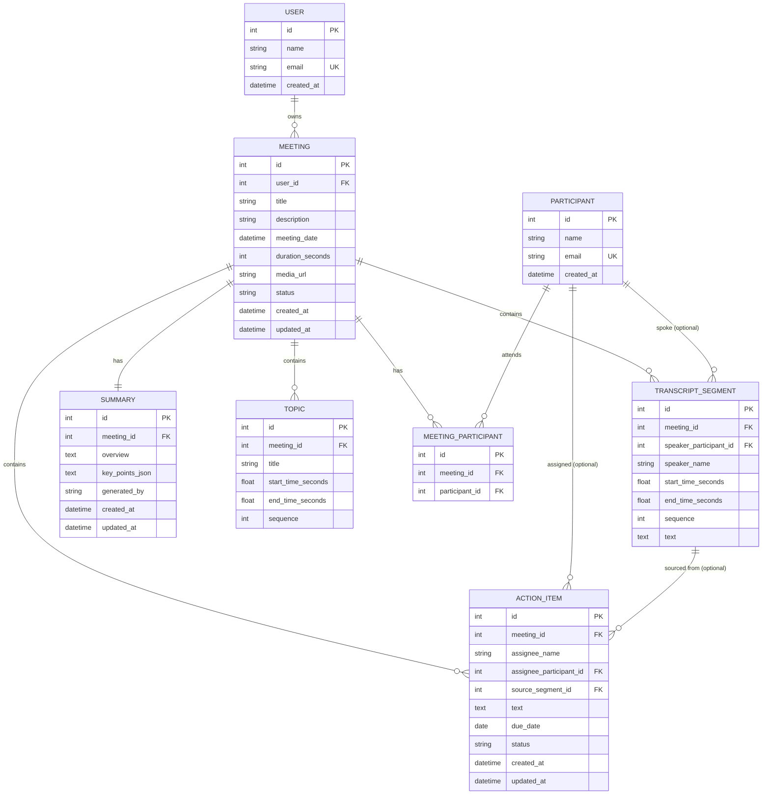

# Database Schema — Meeting Notes & Transcription Platform

**Status:** Proposed / ready for implementation
**Stack:** SQLite + SQLAlchemy (FastAPI backend)
**Scope:** MVP for a graded assignment. This document is the single source of truth for the database. It implements the data layer referenced (but not defined) in `docs/system-design.md`, and supports exactly the mandatory features listed in the assignment's scope specification — no more.

> This is **not** a reproduction of Fireflies.ai's real internal schema. It is a small, normalized, interview-explainable schema sized for a 24-hour assignment.

---

## 1. Domain Model

Before any SQL, here is every entity considered, and why it's in (or out of) the MVP.

| Entity | Represents | Why persist it | Relationships | MVP or future? |
|---|---|---|---|---|
| **User** | The single default account that "owns" meetings | Meetings need an owner column for the dashboard and for future multi-user extensibility, even though there's no login | 1 → N Meetings | **MVP** (minimal) |
| **Meeting** | One recorded/uploaded meeting | Core entity — everything else hangs off it | N ← User; 1 → N TranscriptSegment/Topic/ActionItem; 1 → 1 Summary; N ↔ N Participant | **MVP** |
| **Participant** | A real person who can attend meetings | Reusable across meetings (a person attends many meetings); needed for the participant-filter and autocomplete | N ↔ N Meeting (via junction) | **MVP** |
| **MeetingParticipant** | "This person attended this meeting" | Junction table — required because the Meeting↔Participant relationship is many-to-many and cannot be modeled with a single FK on either side | Meeting N ↔ N Participant | **MVP** |
| **TranscriptSegment** | One spoken utterance/line, with speaker + timing | This *is* the interactive transcript feature — needed for speaker labels, timestamps, search, and player sync | N ← Meeting; optionally references Participant | **MVP** |
| **Summary** | The AI/mock-generated overview + key points for a meeting | One meeting has exactly one current summary; storing it lets the detail page load instantly without regenerating | 1 ← 1 Meeting | **MVP** |
| **Topic / Chapter** | A named segment of the meeting ("Pricing discussion", 4:12–9:30) | Needed for the "key topics / outline / chapters" requirement, and so a future UI can click a chapter and seek the player | N ← Meeting | **MVP** |
| **ActionItem** | A follow-up task extracted from or added to a meeting | Required for action-item CRUD; independent lifecycle (complete/edit/delete) from the rest of the meeting | N ← Meeting; optionally → Participant (assignee), optionally → TranscriptSegment (source) | **MVP** |

Entities *considered and deliberately excluded* from the MVP (see §18 for why): `Tag`, `Comment`, `Highlight`, `Soundbite`, `Session`/`AuthToken`, `Integration`, `TranscriptionJob`. None of these are required by any mandatory feature.

---

## 2. Entity-Relationship Diagram



Cardinality summary: `User 1—N Meeting`, `Meeting 1—N TranscriptSegment`, `Meeting 1—1 Summary`, `Meeting 1—N Topic`, `Meeting 1—N ActionItem`, `Meeting N—N Participant` (via `MeetingParticipant`), plus two optional lightweight FKs (`TranscriptSegment.speaker_participant_id`, `ActionItem.assignee_participant_id` / `source_segment_id`).

---

## 3. Table Definitions

Conventions used throughout:
- All PKs are `INTEGER PRIMARY KEY` (SQLite rowid alias) — simple, fast, sufficient for a single-writer assignment app; no reason to introduce UUIDs.
- All `created_at`/`updated_at` are `TIMESTAMP NOT NULL DEFAULT CURRENT_TIMESTAMP`. `updated_at` is refreshed by the service layer on writes (SQLite has no native `ON UPDATE`, and an app-level `onupdate=` in SQLAlchemy is simplest).
- Timestamps for **playback position** (`start_time_seconds`, `end_time_seconds`) are stored as `REAL` seconds, not formatted strings — see §7 for the reasoning.
- Foreign key enforcement must be turned on per-connection: `PRAGMA foreign_keys = ON` (SQLite disables it by default). This should be set in `db.py` on every new connection (e.g. via SQLAlchemy's `connect` event).

### 3.1 `users`

| Column | Type | Nullable | Default | Key | Description |
|---|---|---|---|---|---|
| id | INTEGER | No | autoincrement | PK | Surrogate key |
| name | TEXT | No | — | | Display name |
| email | TEXT | Yes | NULL | UNIQUE | Optional, unique if present |
| created_at | TIMESTAMP | No | CURRENT_TIMESTAMP | | Row creation time |

- No password/session/role columns — authentication is out of scope (see §11).
- Exactly one row is seeded (`id = 1`); the backend treats it as "the current user" everywhere a user is needed.

### 3.2 `meetings`

| Column | Type | Nullable | Default | Key | Description |
|---|---|---|---|---|---|
| id | INTEGER | No | autoincrement | PK | Surrogate key |
| user_id | INTEGER | No | — | FK → users.id | Owner |
| title | TEXT | No | — | | Shown on dashboard/detail |
| description | TEXT | Yes | NULL | | Optional free-text notes about the meeting |
| meeting_date | TIMESTAMP | No | — | | When the meeting occurred; drives sort/filter |
| duration_seconds | INTEGER | No | 0 | | Total length; used for dashboard display and player bounds |
| media_url | TEXT | Yes | NULL | | Path/URL to placeholder audio/video |
| status | TEXT | No | 'ready' | CHECK IN ('processing','ready','failed') | Upload/parse lifecycle state |
| created_at | TIMESTAMP | No | CURRENT_TIMESTAMP | | |
| updated_at | TIMESTAMP | No | CURRENT_TIMESTAMP | | Bumped on any edit |

- FK: `user_id → users.id` — `ON DELETE RESTRICT` (a user should never silently lose meetings; deleting the single seeded user isn't a real workflow anyway).
- No `participant1/2/3` columns — participants live entirely in the junction table (§3.4), per the assignment's explicit instruction.
- Indexes: `idx_meetings_user_id (user_id)`, `idx_meetings_date (meeting_date)` — see §13.

### 3.3 `participants`

| Column | Type | Nullable | Default | Key | Description |
|---|---|---|---|---|---|
| id | INTEGER | No | autoincrement | PK | Surrogate key |
| name | TEXT | No | — | | Display name |
| email | TEXT | Yes | NULL | UNIQUE | Used to dedupe the same person across meetings when known |
| created_at | TIMESTAMP | No | CURRENT_TIMESTAMP | | |

- `email` is nullable+unique (SQLite allows multiple `NULL`s under a UNIQUE index, so participants without an email don't collide). When creating a participant via `POST /participants`, the service should look up by email first if one is given, to avoid duplicate people.

### 3.4 `meeting_participants` (junction table)

| Column | Type | Nullable | Default | Key | Description |
|---|---|---|---|---|---|
| id | INTEGER | No | autoincrement | PK | Surrogate key (simpler with SQLAlchemy than a composite PK) |
| meeting_id | INTEGER | No | — | FK → meetings.id | |
| participant_id | INTEGER | No | — | FK → participants.id | |

- Constraint: `UNIQUE(meeting_id, participant_id)` — a person can't attend the same meeting twice.
- `meeting_id → meetings.id`: **ON DELETE CASCADE** — deleting a meeting removes its attendance links.
- `participant_id → participants.id`: **ON DELETE RESTRICT** — deleting a participant must not silently delete unrelated meetings or corrupt their attendance history; the app should block/deny deleting a participant who has attendance rows (participant deletion isn't a required feature anyway).
- **Why this table exists:** Meeting↔Participant is genuinely many-to-many (one meeting has several attendees; one person attends many meetings). A single FK on either side can't express that. Storing `participant_1, participant_2, ...` on `meetings` — explicitly forbidden by the assignment — would violate 1NF (repeating groups), block indexed lookups like "meetings X attended", and make adding/removing an attendee an `UPDATE` instead of a clean insert/delete.
- Index: `idx_mp_participant (participant_id)` for "meetings this participant attended" queries; `meeting_id` lookups are already covered by the UNIQUE index above.

### 3.5 `transcript_segments`

| Column | Type | Nullable | Default | Key | Description |
|---|---|---|---|---|---|
| id | INTEGER | No | autoincrement | PK | Surrogate key |
| meeting_id | INTEGER | No | — | FK → meetings.id | Owning meeting |
| speaker_name | TEXT | No | — | | Speaker label as parsed/typed (always present, even if unmatched to a participant) |
| speaker_participant_id | INTEGER | Yes | NULL | FK → participants.id | Optional link if the speaker was resolved to a known participant |
| start_time_seconds | REAL | No | — | | Segment start, in seconds from meeting start |
| end_time_seconds | REAL | No | — | | Segment end, in seconds |
| sequence | INTEGER | No | — | | 0-based order within the meeting |
| text | TEXT | No | — | | The spoken line |

- Constraints: `CHECK(end_time_seconds >= start_time_seconds)`; `UNIQUE(meeting_id, sequence)`.
- `meeting_id → meetings.id`: **ON DELETE CASCADE**.
- `speaker_participant_id → participants.id`: **ON DELETE SET NULL** — losing the participant link shouldn't delete transcript history.
- **Why both `speaker_name` and `speaker_participant_id`:** transcript parsing produces a raw label ("Speaker 2", "Alex") that may not cleanly match a `participants` row. Keeping `speaker_name` mandatory guarantees the transcript always renders correctly; `speaker_participant_id` is a nullable enrichment, not a hard dependency.
- Indexes: `idx_ts_meeting_sequence (meeting_id, sequence)` for ordered rendering; `idx_ts_meeting_start (meeting_id, start_time_seconds)` for player-sync lookups. See §7 and §13.

### 3.6 `summaries`

| Column | Type | Nullable | Default | Key | Description |
|---|---|---|---|---|---|
| id | INTEGER | No | autoincrement | PK | Surrogate key |
| meeting_id | INTEGER | No | — | FK → meetings.id, UNIQUE | One summary per meeting |
| overview | TEXT | No | — | | Short paragraph summary |
| key_points_json | TEXT | No | '[]' | | JSON array of strings — bullet-point key points |
| generated_by | TEXT | No | 'mock' | CHECK IN ('mock','llm') | Which summary path produced this |
| created_at | TIMESTAMP | No | CURRENT_TIMESTAMP | | |
| updated_at | TIMESTAMP | No | CURRENT_TIMESTAMP | | Bumped on regeneration |

- `meeting_id → meetings.id`, **UNIQUE + ON DELETE CASCADE** — the UNIQUE constraint is what makes this a true 1:1 relationship in SQLite (there's no native "one-to-one" FK type; uniqueness on the FK is the standard way to express it).
- `key_points_json` is a JSON array of short strings (SQLAlchemy `JSON` type, stored as `TEXT` in SQLite). This is intentionally the *only* JSON column in the schema (see §8 for why topics are **not** duplicated here).

### 3.7 `topics`

| Column | Type | Nullable | Default | Key | Description |
|---|---|---|---|---|---|
| id | INTEGER | No | autoincrement | PK | Surrogate key |
| meeting_id | INTEGER | No | — | FK → meetings.id | Owning meeting |
| title | TEXT | No | — | | Chapter/topic label ("Pricing discussion") |
| start_time_seconds | REAL | Yes | NULL | | Where this chapter begins, for player seeking |
| end_time_seconds | REAL | Yes | NULL | | Where it ends |
| sequence | INTEGER | No | — | | Display order |

- Constraints: `UNIQUE(meeting_id, sequence)`; `CHECK(start_time_seconds IS NULL OR end_time_seconds IS NULL OR end_time_seconds >= start_time_seconds)`.
- `meeting_id → meetings.id`: **ON DELETE CASCADE**.
- Times are nullable because a mock/LLM extraction may produce a topic label without a confident timestamp; the UI can still render it as an outline item without seek support in that case.

### 3.8 `action_items`

| Column | Type | Nullable | Default | Key | Description |
|---|---|---|---|---|---|
| id | INTEGER | No | autoincrement | PK | Surrogate key |
| meeting_id | INTEGER | No | — | FK → meetings.id | Owning meeting |
| text | TEXT | No | — | | The task description |
| assignee_name | TEXT | Yes | NULL | | Assignee label as typed/extracted, always shown even if unresolved |
| assignee_participant_id | INTEGER | Yes | NULL | FK → participants.id | Optional link if the assignee was resolved to a known participant |
| due_date | DATE | Yes | NULL | | Optional due date |
| status | TEXT | No | 'open' | CHECK IN ('open','completed') | Completion state |
| source_segment_id | INTEGER | Yes | NULL | FK → transcript_segments.id | Transcript line it was extracted from, if any |
| created_at | TIMESTAMP | No | CURRENT_TIMESTAMP | | |
| updated_at | TIMESTAMP | No | CURRENT_TIMESTAMP | | Bumped on edit/toggle |

- `meeting_id → meetings.id`: **ON DELETE CASCADE**.
- `assignee_participant_id → participants.id`: **ON DELETE SET NULL**.
- `source_segment_id → transcript_segments.id`: **ON DELETE SET NULL** — if the source segment is ever removed, the action item survives as a plain task instead of vanishing.
- **`status` enum vs. boolean:** a `CHECK`-constrained `status TEXT` was chosen over `is_completed BOOLEAN`. It reads the same for the MVP's two states but leaves room for a future `in_progress` value without an app-wide boolean-to-enum migration — a low-cost choice, not added complexity (SQLite has no native enum type, so a `CHECK` constraint is the idiomatic equivalent).
- **Why `source_segment_id`:** lets the UI show "jump to where this was said" next to an action item, reusing the same seek mechanism as the transcript/topics — useful and effectively free once `transcript_segments` already has stable IDs and timestamps.
- **Why both `assignee_name` and `assignee_participant_id`:** identical reasoning to `speaker_name`/`speaker_participant_id` on `transcript_segments` (§3.5). Mock/LLM extraction produces a raw name ("Alex") that may not exactly match a `participants` row; `assignee_name` guarantees the action item always displays *something*, while `assignee_participant_id` is a nullable enrichment used only when resolution succeeds (e.g. for filtering "my action items" or linking to a participant's profile later).

---

## 4. Participants: Why the Junction Table (recap)

A meeting has many participants; a participant attends many meetings — a genuine many-to-many relationship:

```
Meeting  1 ↔ N  MeetingParticipant  N ↔ 1  Participant
```

Storing `participant_1, participant_2, participant_3` directly on `meetings` was explicitly avoided because it: (1) caps the number of attendees, (2) prevents indexing/filtering by participant, (3) violates First Normal Form (repeating groups of the same kind of data in one row), and (4) makes "who else was in meetings with Alex" unanswerable without string parsing. The junction table fixes all four with one small table and one UNIQUE constraint.

---

## 5. Transcript Design

The transcript is the core interactive feature, so every field earns its place against a concrete requirement:

| Requirement | Field(s) |
|---|---|
| Speaker labels | `speaker_name` (+ optional `speaker_participant_id`) |
| Timestamps | `start_time_seconds`, `end_time_seconds` |
| Ordered rendering | `sequence` |
| Click-to-seek | `start_time_seconds` is passed straight to `player.currentTime` |
| Determine active segment from player time | Query segments for this meeting where `start_time_seconds <= currentTime < next.start_time_seconds` (equivalently, the frontend binary-searches the already-loaded, `sequence`-ordered array — see system design §3) |
| Transcript search | `LIKE`-based text search over `text`, scoped to `meeting_id` (see §14) |

**Numeric seconds vs. formatted timestamp strings:** `start_time_seconds`/`end_time_seconds` are stored as `REAL` (floating-point seconds from meeting start), not as `"00:04:12"` strings. Reasons:
- The player's `currentTime` API is already a float in seconds — numeric storage means zero parsing on the hot path (every `timeupdate` tick).
- Range comparisons and `ORDER BY`/`CHECK` constraints work natively on numbers; string timestamps would need parsing before any comparison, and are error-prone to sort correctly as text.
- Formatting `4:12` for display is a trivial, cheap frontend transform in one place; going the other direction (parsing a string back to a comparable number on every tick) would be repeated, wasted work.

**Constraints:**
- `end_time_seconds >= start_time_seconds` — rejects malformed parses at the database level, not just in application code.
- `UNIQUE(meeting_id, sequence)` — guarantees a single, unambiguous rendering order per meeting and prevents accidental duplicate-sequence bugs during transcript parsing.
- `meeting_id` FK with `ON DELETE CASCADE` — a segment cannot exist without owning meeting; deleting a meeting cleans up all of its transcript.

---

## 6. Summary vs. Topics — the Key Design Decision

The assignment requires: an overview/summary, key points, and topics/outline/chapters. Two designs were evaluated:

- **A — Everything in `Summary` as JSON** (`overview`, `key_points`, *and* `outline` all as JSON blobs). Rejected: topics need `start_time_seconds`/`end_time_seconds` for the "click a chapter, seek the player" requirement — that means querying/sorting on a timestamp *inside* a JSON blob, which SQLite can only do awkwardly (`json_extract`), defeats indexing, and duplicates the same shape (`{title, start, end}`) that `TranscriptSegment` and `Topic` already need as real columns elsewhere.
- **B — Separate normalized `Topic` rows** (chosen). Each topic is one row with real, indexable, sortable `start_time_seconds`/`sequence` columns — directly reusable by the same seek logic as transcript segments.
- **Hybrid considered:** keep `key_points` as JSON on `Summary` (chosen) but topics as their own table (chosen). This is the actual final design: `key_points` are short, display-only strings with no independent identity, timing, or query need — JSON is the right fit there. Topics *do* need timing and ordering — a real table is the right fit there. Using JSON for both, or a table for both, would each be worse for one half of the requirement; **this document does not duplicate topic data in both places** — `topics` is the single source of truth for chapters, and `summaries.key_points_json` never repeats topic titles or timestamps.

**MVP recommendation:** `Summary.overview` (text) + `Summary.key_points_json` (JSON array of strings) for the narrative summary; `Topic` as a normalized table for anything timestamp-addressable. This is the design implemented in §3.6–3.7.

---

## 7. Action Items — Design Recap

See §3.8 for the full column list. Summary of the two decisions called out by the assignment:

- **Status as a `CHECK`-constrained enum**, not a bare boolean — same effort as a boolean today, avoids a migration if a third state (e.g. "in progress") is ever needed.
- **Optional `source_segment_id`** — lets an action item point back at the transcript line it came from, enabling a "jump to context" UI affordance, at the cost of one nullable FK.

No due-date reminders, priority levels, subtasks, or tagging were added — none are required by the assignment, and each would add task-management complexity the spec explicitly says to avoid.

---

## 8. Users / Authentication

**Decision: keep a minimal `User` table**, per §11 of the assignment brief.

> Authentication is not implemented; the application assumes a default logged-in user. The `User` entity exists primarily for ownership (`meetings.user_id`) and future extensibility.

No password hash, no OAuth fields, no session/token table, no roles/permissions table. Exactly one row is seeded and every meeting's `user_id` points at it. If real auth were added later, only `users` gains columns (or a related `credentials` table) and a session layer sits in front of the existing routers — `meetings.user_id` already points at the right place, so no schema change ripples into the rest of the tables.

---

## 9. Normalization

The schema targets a pragmatic **3NF** — normalized enough to avoid update anomalies and duplicated facts, not normalized for its own sake:

- **1NF:** every column holds a single atomic value. No comma-separated lists anywhere (e.g. no `participant_names TEXT` on `meetings`).
- **No repeating participant columns:** solved by `meeting_participants` (§4), not `participant_1..N` columns.
- **Reusable participant data lives once:** a person's `name`/`email` is stored once in `participants` and referenced by every meeting/action item they're linked to, rather than copied per-meeting.
- **Transcript is fully decomposed:** one row per spoken segment (`transcript_segments`), not one giant `TEXT` blob per meeting — this is what makes search, per-line timestamps, and speaker labels possible at all.
- **No duplicated meeting metadata:** `title`/`date`/`duration` live only on `meetings`; nothing else re-stores them.
- **No duplicated summary/topic data:** enforced explicitly in §6 — `key_points_json` never repeats what `topics` rows already say.

Deliberately **not** over-normalized: `speaker_name` is kept as a plain column on `transcript_segments` even though it duplicates a `participants.name` when resolved (§3.5) — pulling it into a strict lookup would break rendering for unmatched/unknown speakers, which real transcripts frequently have. That's a conscious, justified denormalization, not an oversight.

---

## 10. Indexing Strategy

SQLite foreign-key enforcement must be explicitly enabled per connection (`PRAGMA foreign_keys = ON`) — it is off by default, and without it the `ON DELETE CASCADE`/`SET NULL`/`RESTRICT` behaviors below silently do nothing.

| Index | Table (columns) | Query it improves | Why |
|---|---|---|---|
| `idx_meetings_user_id` | meetings(user_id) | "meetings owned by user X" (every dashboard load) | Avoids a full scan; small table today, but the right habit as data grows |
| `idx_meetings_date` | meetings(meeting_date) | Dashboard default sort ("most recent first") and date-range filtering | Sorting/filtering the primary list view is the single most frequent query in the app |
| `idx_ts_meeting_sequence` | transcript_segments(meeting_id, sequence) | Loading a meeting's transcript in order | Composite index serves both the FK lookup and the `ORDER BY sequence` in one pass; also backs the `UNIQUE(meeting_id, sequence)` constraint |
| `idx_ts_meeting_start` | transcript_segments(meeting_id, start_time_seconds) | "find the segment containing player time T" | Supports the player-sync query directly; without it, syncing would scan every segment on every tick |
| `idx_action_items_meeting_status` | action_items(meeting_id, status) | "open action items for this meeting" (detail page default view) | Filters by the two columns the UI actually filters on together |
| `idx_mp_participant` | meeting_participants(participant_id) | "meetings this participant attended" (participant filter) | The `UNIQUE(meeting_id, participant_id)` constraint already indexes `meeting_id` first, so this covers the reverse lookup |
| `idx_topics_title` | topics(title) | `GET /topics` — the distinct topic list used to populate the library's filter sidebar (per system design §4) | Without it, building the sidebar means scanning every topic row across every meeting each time the dashboard loads |
| `idx_participants_name` | participants(name) | `GET /participants?query=` — name autocomplete when adding someone to a meeting | This endpoint is called on every keystroke of the add-participant field, unlike the once-per-page-load queries above, so it's worth the small index even at seed-data scale |

**Not indexed, deliberately:** `topics.meeting_id` beyond its existing `UNIQUE(meeting_id, sequence)` (topic lists are tiny per meeting — a handful of rows, sequential scan is fine); `summaries.meeting_id` beyond its `UNIQUE` constraint (already an index, and it's a single-row lookup by definition). Adding indexes to tables this small would add write overhead for no measurable read benefit — the assignment explicitly warns against indexing everywhere.

---

## 11. Search Strategy

Two search requirements: **meeting search** (title, on the dashboard) and **transcript search** (within a meeting detail page).

**Recommendation: plain SQL `LIKE` (case-insensitive) for both, no FTS5.**

- **Meeting search:** `WHERE title LIKE '%' || :query || '%' COLLATE NOCASE`, combined with the `idx_meetings_date` sort. The `meetings` table is small (a seeded/demo dataset — tens to low hundreds of rows), so a `LIKE` scan is effectively instant; no index can accelerate a leading-wildcard `LIKE` anyway, so this is the same cost with or without extra tooling.
- **Transcript search:** per system design §3, transcript lines for the currently open meeting are already loaded client-side for the interactive transcript UI, so search is a client-side substring filter — no additional backend query at all. If a future "search across all meetings' transcripts" bonus feature is added, that's the one case where SQLite `FTS5` would genuinely help (it's built into SQLite, so it wouldn't add an external dependency) — noted in §18 as a future option, not built now.

**Why not FTS5 now:** it's a second table (a virtual table + triggers to keep it in sync with `transcript_segments`) for a search corpus that, at assignment scale, `LIKE` already answers in milliseconds. Adding it would be complexity without a measurable benefit — exactly what the brief asks to avoid.

---

## 12. Data Integrity & Cascade Behavior

| Rule | Where enforced |
|---|---|
| Every FK relationship is declared with `FOREIGN KEY ... REFERENCES` | All tables in §3 |
| `NOT NULL` on every column that the app cannot function without | Per-table definitions in §3 |
| `UNIQUE` on `(meeting_id, sequence)` for segments and topics; on `users.email`/`participants.email`; on `summaries.meeting_id`; on `(meeting_id, participant_id)` | Per-table definitions in §3 |
| `CHECK` on `meetings.status`, `summaries.generated_by`, `action_items.status`, and both `end_time >= start_time` constraints | Per-table definitions in §3 |
| SQLite foreign-key enforcement | `PRAGMA foreign_keys = ON` on every connection (§10) |

**Cascade summary — deleting a meeting removes:**
`transcript_segments`, `summary`, `topics`, `action_items`, `meeting_participants` rows for that meeting — all four/five are `ON DELETE CASCADE` from `meeting_id`. This is intentional: none of that data has any meaning without its parent meeting.

**Cascade summary — deleting a participant does *not* delete meetings:**
`meeting_participants.participant_id` is `ON DELETE RESTRICT` (blocks the delete if attendance rows exist — participant deletion isn't a required feature, so being conservative here is safe); `transcript_segments.speaker_participant_id` and `action_items.assignee_participant_id` are `ON DELETE SET NULL` — removing a participant degrades those references gracefully instead of destroying transcript/action-item history.

---

## 13. Transactions

The multi-step "create a meeting with a transcript" flow (matching system design §7) touches several tables and must not leave a half-created meeting if any step fails:

```
BEGIN
  INSERT meeting (status='processing')
  resolve/INSERT participants as needed
  INSERT meeting_participants rows
  parse transcript text
  INSERT transcript_segments rows (bulk)
  INSERT summary row
  INSERT topics rows
  INSERT action_items rows (if any extracted)
  UPDATE meeting SET status='ready'
COMMIT
```

Wrapping this in a single SQLAlchemy session/transaction (commit once at the end, rollback on any exception) means a failure partway through — e.g. a malformed transcript line — leaves **no** partial meeting behind, rather than a meeting with a title but no transcript. `meeting_id`-scoped `ON DELETE CASCADE` (§12) is a safety net for manual deletes, not a substitute for wrapping the creation flow in a transaction.

---

## 14. Seed Data

The schema supports deterministic seeding on backend startup (`seed.py`, per system design §12): insert one `users` row, then for each of several sample meetings insert the meeting row, its `participants`/`meeting_participants`, a full ordered set of `transcript_segments`, one `summaries` row, a few `topics` rows, and a couple of `action_items`. Because every child table's FK points at `meeting.id` and ordering is explicit (`sequence`), the seed script can run in a fixed, predictable order and the app is immediately browsable — dashboard, transcript, summary, and action items all populated — right after `db.py` creates the tables.

---

## 15. Future Extensibility (not built now)

These are explicitly **not** added to the MVP schema, to avoid over-engineering, but the current design doesn't block any of them:

| Future need | How it would extend the schema |
|---|---|
| Real authentication | Add credential/session columns (or a `credentials` table) to/around `users`; no change to `meetings.user_id` |
| Real audio/video storage | Replace `meetings.media_url` with a proper `media_assets` table (storage key, size, mime type) |
| Comments | New `comments` table: `meeting_id` FK + optional `segment_id` FK, `author`, `text`, `created_at` |
| Transcript highlights | New `highlights` table referencing `transcript_segments` |
| Tags | New `tags` + `meeting_tags` junction table, same shape as `meeting_participants` |
| Soundbites | New `soundbites` table: `meeting_id`, `start_time_seconds`, `end_time_seconds`, `title` |
| Collaboration | Extend `users` to real multi-user, add per-meeting sharing/permissions table |
| Integrations (Zoom/Calendar) | New `integration_connections` + `external_meeting_id` column on `meetings` |
| Real transcription jobs | A `status`-tracked job row referencing `meetings.id`, feeding `transcript_segments` asynchronously instead of synchronously |

None of these are migrations away from the current design — they're additive tables/columns layered onto it, which is the payoff of keeping the MVP schema small and normalized now.

---

## 16. SQLAlchemy Model Mapping

| Conceptual entity | SQLAlchemy model | Table |
|---|---|---|
| User | `User` | `users` |
| Meeting | `Meeting` | `meetings` |
| Participant | `Participant` | `participants` |
| MeetingParticipant | `MeetingParticipant` | `meeting_participants` |
| TranscriptSegment | `TranscriptSegment` | `transcript_segments` |
| Summary | `Summary` | `summaries` |
| Topic | `Topic` | `topics` |
| ActionItem | `ActionItem` | `action_items` |

All eight models above are implemented; no additional models exist in the MVP. `Meeting.participants` (via `MeetingParticipant`) and `Meeting.transcript_segments`/`topics`/`action_items`/`summary` are expected as ORM relationships with matching `cascade="all, delete-orphan"` where the DB-level `ON DELETE CASCADE` is set, to keep ORM behavior consistent with the schema when objects are deleted through the session rather than raw SQL.

---

## 17. Final Schema Summary

| Table | Purpose | Main Relationship |
|---|---|---|
| `users` | Default account for meeting ownership | 1 → N `meetings` |
| `meetings` | Core meeting record | N ← `users`; 1 → N `transcript_segments`/`topics`/`action_items`; 1 → 1 `summaries`; N ↔ N `participants` |
| `participants` | Reusable person record | N ↔ N `meetings` via `meeting_participants` |
| `meeting_participants` | Attendance junction | Meeting ↔ Participant |
| `transcript_segments` | Ordered, timestamped, speaker-labeled transcript lines | N ← `meetings` |
| `summaries` | Overview + key points per meeting | 1 ← 1 `meetings` |
| `topics` | Timestamped chapters/outline | N ← `meetings` |
| `action_items` | Follow-up tasks | N ← `meetings`; optional → `participants`, `transcript_segments` |

### Final Relationship Summary

```text
User 1 → N Meetings
Meeting 1 → N TranscriptSegments
Meeting 1 → 1 Summary
Meeting 1 → N Topics
Meeting 1 → N ActionItems
Meeting N ↔ N Participants (via MeetingParticipant)
TranscriptSegment N → 1 Participant (optional, speaker resolution)
ActionItem N → 1 Participant (optional, assignee)
ActionItem N → 1 TranscriptSegment (optional, source)
```

---

## 18. Internal Consistency Check

- ✅ Every FK points at an existing PK or UNIQUE column (`users.id`, `meetings.id`, `participants.id`, `transcript_segments.id`).
- ✅ Every relationship in the ERD (§2) matches a declared FK in §3.
- ✅ No entity is duplicated — `Topic` is the single source of chapter/outline data (§6); no JSON re-encodes what a table already stores.
- ✅ No field is referenced elsewhere without being defined (`speaker_participant_id`, `assignee_participant_id`, `source_segment_id` are all defined where used).
- ✅ Delete behavior is consistent: everything scoped to a meeting cascades with it; nothing about a participant or transcript segment can cascade-delete a meeting.
- ✅ Indexes (§10) map to real queries from the API surface in `system-design.md` (`GET /meetings`, transcript rendering, player sync, action-item filtering, participant filtering) — none were added speculatively.
- ✅ Every mandatory database-backed feature from the assignment scope is covered: library/dashboard, search/filter/sort, meeting detail, interactive transcript, speaker labels, timestamps, transcript↔player sync, transcript search, summaries, topics/chapters, action items, meeting CRUD, action-item CRUD, participants, persistence, and seed data.
- ✅ Every REST endpoint named in `system-design.md` §4 has a matching column/index: `GET /topics` (`idx_topics_title`), `GET /participants?query=` (`idx_participants_name`), assignee display on `GET /meetings/{id}/action-items` (`action_items.assignee_name`).
- ✅ No optional/bonus feature (tags, comments, highlights, soundbites, export, global search, Q&A chat, dark mode) was accidentally made mandatory — all are addressed only as future extensions in §15, not as MVP tables.
