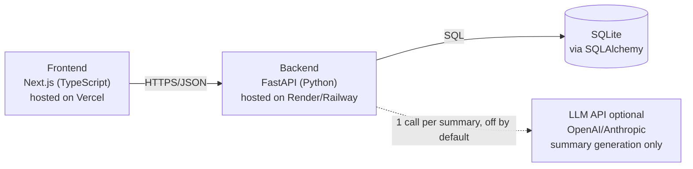
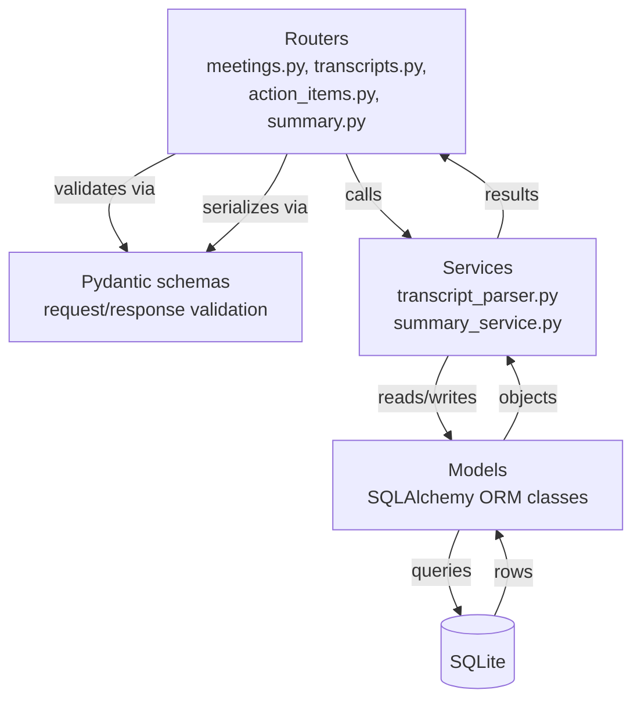
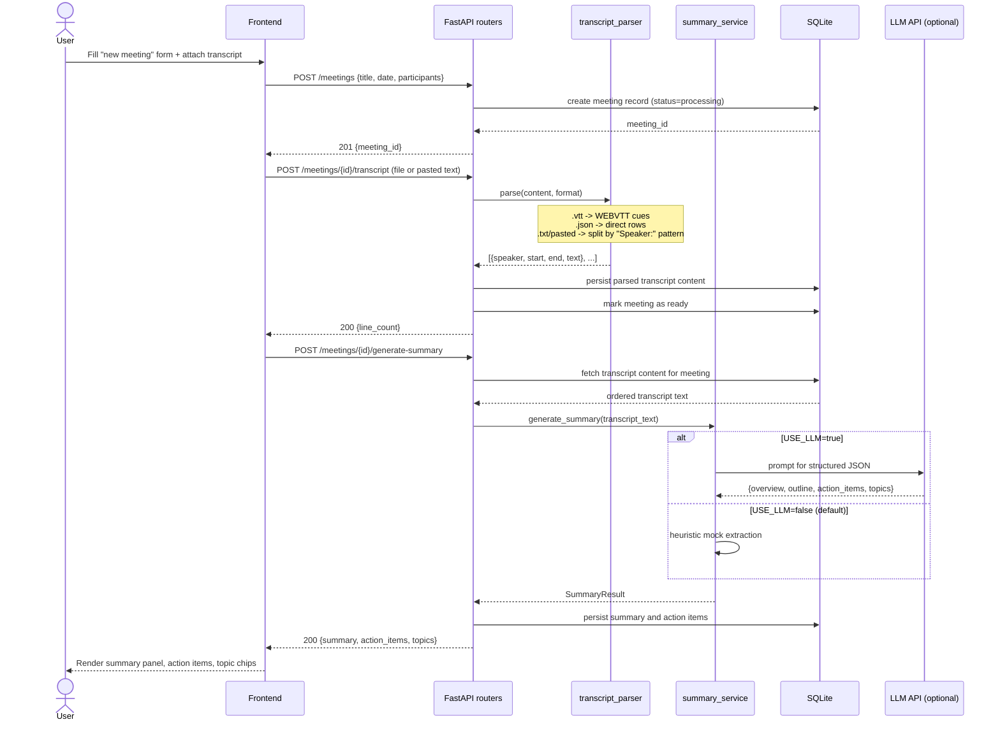
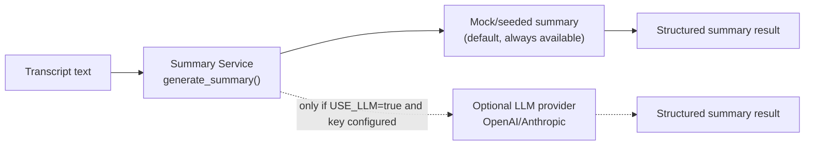
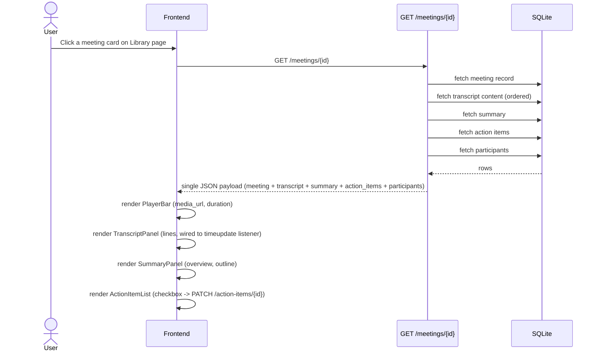

# System Design — Meeting Notes & Transcription Platform (Fireflies Clone)

**Scope:** MVP for a graded assignment. Designed to be fully implementable in ~24 hours, defensible in an interview, and limited strictly to what the assignment asks for. No real transcription, no real-time bots, no multi-tenant auth.

---

## 1. Goals & Non-Goals

**Must build (from assignment):**
- Meetings library with search/filter/sort
- Meeting detail view: transcript + player + summary/action items
- CRUD on meetings, transcripts, action items
- Mocked/LLM-generated summaries from transcript text
- Seeded data, single default user

**Explicitly out of scope (placeholders only):**
- Real speech-to-text
- Live call bots / calendar / Zoom integrations
- Real auth (multi-user, OAuth, sessions with real security)
- Team sharing/collaboration

Keeping these two lists separate is the main thing that keeps the design small.

---

## 2. High-Level Architecture



Two services, one database file, one optional external call. That's the whole system — no message queues, no microservices, no separate media/CDN service needed for an MVP. This diagram is plain text (Mermaid), not a linked image file, so it renders correctly on GitHub, in VS Code previews, and anywhere else Markdown+Mermaid is supported — no separate SVG to keep track of.

**Database boundary:** at the architecture level, the data layer is `Next.js → FastAPI → SQLAlchemy → SQLite`. Detailed database design — tables, columns, primary/foreign keys, cardinality, indexes, constraints, cascade behavior, normalization decisions, and the final ERD — is intentionally maintained as a separate document, `docs/database-schema.md`. This system design only describes the database at an architectural level; it does not finalize the schema.

---

## 3. Frontend Architecture (Next.js + TypeScript)

**Pages / routes (App Router):**
- `/` — Meetings Library (list, search, filter, sort)
- `/meetings/[id]` — Meeting Detail (transcript + player + summary + action items)
- `/meetings/new` — Create meeting (upload transcript / paste text / form)
- `/settings` — placeholder page

**Component structure:**
```
components/
  layout/        Navbar, Sidebar
  library/       MeetingCard, MeetingFilters, SearchBar
  meeting/       TranscriptPanel, TranscriptLine, PlayerBar,
                 SummaryPanel, ActionItemList, TopicChips
  shared/        Modal, Toast, Button, EmptyState
lib/
  api.ts         thin fetch wrapper for backend REST calls
  types.ts       shared TS types mirroring backend schemas
```

**State management:** React state + `fetch`/SWR (or React Query) for server data. No global state library needed — the app is CRUD + one detail view; per-page state is enough.

**Transcript ↔ Player sync (the one genuinely tricky frontend piece):**
- Each transcript line has a `start_time_seconds`.
- Clicking a line calls `playerRef.currentTime = line.start_time_seconds`.
- A `timeupdate` listener on the `<video>/<audio>` element finds the transcript line whose `[start, next.start)` window contains the current time, and highlights/scrolls to it.
- Implement as a small hook, e.g. `useTranscriptSync(lines, playerRef)`, so the logic isn't duplicated in the component.

**Transcript search:** client-side filter over already-loaded transcript lines (transcripts are small enough — a meeting rarely exceeds a few thousand words) with matched substrings wrapped in `<mark>`. No need for a search index.

---

## 4. Backend / API Architecture (FastAPI)

```
backend/
  app/
    main.py
    models/          SQLAlchemy models
    schemas/         Pydantic request/response schemas
    routers/
      meetings.py
      transcripts.py
      action_items.py
      upload.py
      summary.py
    services/
      transcript_parser.py   # parse .txt/.vtt/.json into TranscriptLine rows
      summary_service.py     # mock OR call LLM, behind one interface
    db.py
    seed.py
  storage/            uploaded media files (local disk for MVP)
```

**Design principle:** one thin router layer (HTTP concerns only) → service layer (business logic) → SQLAlchemy models. Keeps it modular without over-engineering.

**Layered request flow:**



Routers never touch SQLAlchemy directly and services never touch HTTP — this is what keeps `summary_service.py` reusable (it's called the same way whether triggered from the API or, later, a background worker), and what makes each layer testable in isolation.

### Core REST endpoints

| Method | Path | Purpose |
|---|---|---|
| GET | `/meetings?query=&participant=&from=&to=&sort=` | List/search/filter/sort meetings |
| POST | `/meetings` | Create meeting (metadata, participant list, optional transcript) |
| GET | `/meetings/{id}` | Full meeting detail (transcript + summary + action items + participants) |
| PATCH | `/meetings/{id}` | Edit metadata (title, date, participants) |
| DELETE | `/meetings/{id}` | Delete meeting (cascades to related transcript/summary/action-item data — cascade behavior defined in `database-schema.md`) |
| POST | `/meetings/{id}/transcript` | Upload/replace transcript file (.txt/.vtt/.json) or pasted text |
| POST | `/meetings/{id}/generate-summary` | Trigger mock/LLM summary + action item + topic extraction |
| GET | `/meetings/{id}/action-items` | List action items for a meeting |
| POST | `/meetings/{id}/action-items` | Add an action item |
| PATCH | `/action-items/{id}` | Edit text/assignee, or mark complete |
| DELETE | `/action-items/{id}` | Delete an action item |
| GET | `/participants?query=` | List/search participants (autocomplete when adding to a meeting) |
| POST | `/participants` | Create a new participant (used when the autocomplete has no match) |
| GET | `/topics` | List all topics (for the filter sidebar) |

This is deliberately a plain REST CRUD surface — no GraphQL, no versioning scheme needed for an assignment of this size.

---

## 5. Database (Architectural Reference Only)

The database sits at the bottom of the request path: `Next.js → FastAPI → SQLAlchemy → SQLite`.

At a high level, the schema will cover: meetings, participants, transcript content, generated summaries, and action items, related in the obvious way (a meeting has transcript content, a summary, action items, and participants). That relational shape is enough to reason about the rest of this document.

**Detailed database design — tables, columns, primary/foreign keys, cardinality, indexes, constraints, cascade behavior, normalization decisions, and the final ERD — is out of scope for this document and will be defined separately in `docs/database-schema.md`.**

---

## 6. Authentication / Authorization

**No real authentication is implemented.** The application assumes a single default logged-in user for the entire session — there is no login screen, no signup flow, and no credential handling anywhere in the implemented architecture.

**What is and isn't in scope:**
- A `User` concept/entity may be retained purely for **meeting ownership** (e.g. a `user_id` reference on a meeting) and future extensibility — not for access control.
- No OAuth, no JWT, no third-party auth provider (Clerk, Auth0, etc.), no sessions/cookies-based auth, no role-based access control, no password storage or management.
- The frontend shows a static profile name/avatar in the navbar purely as UI — it is not backed by any authentication check.
- `/settings` is a visual placeholder only.

This is a direct implementation of the assignment's stated assumption, not a simplified version of a real auth system — there is no auth system to simplify. If asked in the interview how this would extend to multi-user, the honest answer is: a real auth layer (sessions or JWT) would sit in front of the existing routers without changing their internals, since ownership is already modeled via the `user_id` reference.

---

## 7. Upload & "Transcription" Flow (mocked, not real STT)

This is the flow that replaces real speech-to-text per the assignment.



**Media file itself:** just stored as a static file (or a fixed sample MP3/MP4 shipped with the repo) and served back via `media_url`. The player doesn't need the audio to correspond to the transcript content — the assignment explicitly allows a placeholder file. Only the *timestamps* need to be real.

---

## 8. AI Summary Architecture (optional, not mandatory)

Used in exactly one place: **generating summary / action items / topics from transcript text.** The application must work fully with zero configuration — no LLM API key required.



```python
# services/summary_service.py — single interface, swappable implementation
def generate_summary(transcript_text: str) -> SummaryResult:
    if settings.USE_LLM:
        return _generate_via_llm(transcript_text)   # one call to OpenAI/Anthropic
    return _generate_mock(transcript_text)          # deterministic canned/heuristic output
```

- **Mock mode is the default** and requires no external dependency: extract first N sentences as "overview", pull lines containing action-ish verbs ("will", "need to", "should") as action items, take most frequent noun phrases as topics. This alone satisfies the assignment's "seeded/mock AI content is acceptable" requirement.
- **LLM mode is strictly optional, bonus polish**, activated only when `USE_LLM=true` and an API key is present: one synchronous call per meeting, prompting for structured JSON (`overview`, `outline[]`, `action_items[]`, `topics[]`).
- Called **synchronously** on `POST /meetings/{id}/generate-summary` — a single LLM call for a short transcript typically returns in a few seconds, so no background job/queue is needed for the assignment scale.
- LLM processing is never a required dependency anywhere in the request path — if `USE_LLM` is unset or the key is missing, the app silently falls back to mock mode rather than failing.

---

## 9. Real-Time / Background Processing

**Not needed as infrastructure** for this MVP:
- Real-time transcription is explicitly out of scope, so there's no live stream to process.
- Transcript parsing and mock summary generation are both lightweight, synchronous, in-request operations.
- The assignment does not require asynchronous workers, and no feature here has a genuine multi-second-plus processing time that would justify one.
- **Redis, Celery, and Kafka are intentionally not included** — there is no queue, no message broker, and no worker process anywhere in this architecture.

The only "async-feeling" UX is the `status: processing → ready` field, which can be simulated with a short artificial delay or just set synchronously — either is fine and both are honest about not doing real background work.

*(If you want to show system-design range in the interview: mention that at real scale, upload → parse → summarize would move to a task queue with a `status` column and the frontend would poll `GET /meetings/{id}` until `status=ready`. That's a one-sentence "here's how I'd scale it," not something to build.)*

---

## 10. External Services

**In the implemented MVP architecture — the only one:**

| Service | Required? | Why |
|---|---|---|
| LLM API (OpenAI/Anthropic) | No — optional | Only used when `USE_LLM=true`; the app is fully functional without it (see Section 8) |

**Future / Placeholder / Out of Scope — not part of the implemented architecture:**

| Service | Status | Why it's excluded from the MVP |
|---|---|---|
| Zoom / Google Meet / Teams / Webex | Placeholder only | Real-time meeting capture is explicitly out of scope |
| Calendar integration | Placeholder only | Not required by the assignment |
| CRM integrations | Placeholder only | Not required by the assignment |
| Object storage (S3, etc.) | Not included | Local disk / repo-bundled sample file is enough for an MVP demo |
| Redis / Celery / Kafka | Not included | No background processing is required (see Section 9) |
| Auth provider (OAuth/Clerk/etc.) | Not included | Default user only (see Section 6) |
| Email/notifications | Not included | Toasts are in-app only |

Keeping the implemented architecture down to one optional external call minimizes deployment/config risk before the deadline, and makes clear in the interview that everything in the second table was a deliberate scoping decision, not an oversight.

---

## 11. Request/Data Flow — Example: Opening a Meeting



One aggregate GET for the detail view (rather than five separate round trips) keeps the frontend simple and avoids waterfall loading — the backend does the joins, not the client.

---

## 12. Deployment Architecture

```
Frontend (Next.js)  →  Vercel
Backend (FastAPI)   →  Render / Railway  (free tier is fine)
Database            →  SQLite file on the backend's persistent disk
                        (Render/Railway both support a small persistent volume;
                         if not available, note in README that Postgres is the
                         natural swap for production)
Media files          →  served as static files from the backend, or bundled
                        in the repo under /public if using the frontend directly
```

- CORS enabled on FastAPI for the Vercel domain.
- Environment variables: `LLM_API_KEY` (optional), `USE_LLM` flag, `DATABASE_URL`.
- Seed script (`seed.py`) runs on backend startup/deploy to guarantee the demo always has data — this is explicitly required by the assignment ("seed your database").

---

## 13. Must-Have vs Optional Summary

| Component | Must-have | Notes |
|---|---|---|
| Meetings library (search/filter/sort) | ✅ | |
| Transcript + player sync | ✅ | Core interactive feature graded |
| Summary/action items/topics (mocked or LLM) | ✅ | Mock is enough; LLM is a nice-to-have layer on the same interface |
| CRUD on meetings/action items | ✅ | |
| Seeded data | ✅ | |
| Default user, no real auth | ✅ | |
| README (arch, schema, setup) | ✅ | |
| Background job queue | ❌ | Explicitly unnecessary at this scale |
| Real STT | ❌ | Out of scope per assignment |
| Comments/highlights/soundbites | ⭐ Bonus | Extends the schema (defined in `database-schema.md`) if time allows |
| Export (PDF/MD/TXT) | ⭐ Bonus | Pure backend serialization of existing data — cheap to add |
| Global search | ⭐ Bonus | SQLite full-text search across meetings and transcripts |
| Ask-a-question chat about meeting | ⭐ Bonus | Same `summary_service` LLM interface, different prompt (RAG not needed — transcript fits in context) |
| Dark mode | ⭐ Bonus | Pure frontend (CSS variables/theme toggle) |

The service boundaries above already leave room for every bonus item without restructuring — worth pointing out in the interview as intentional.
